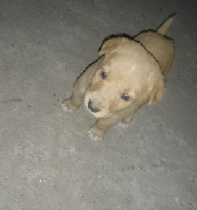
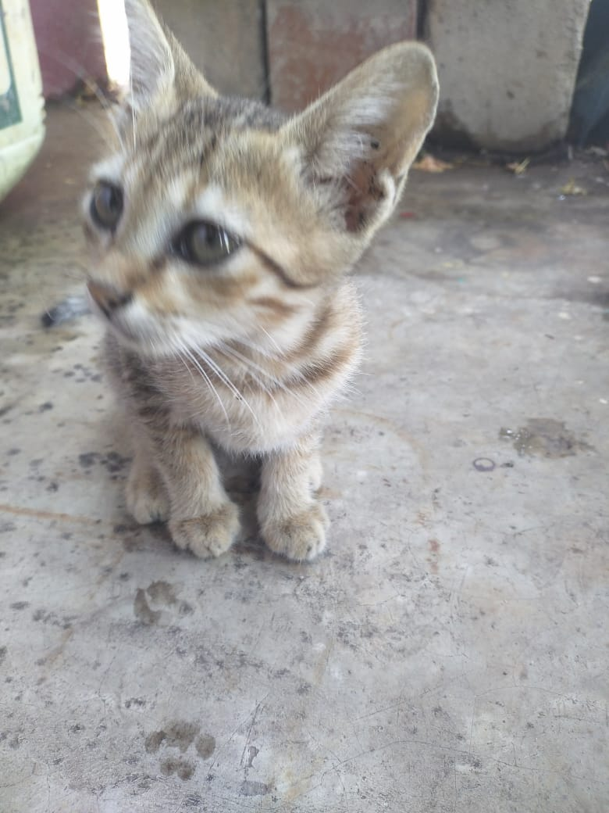
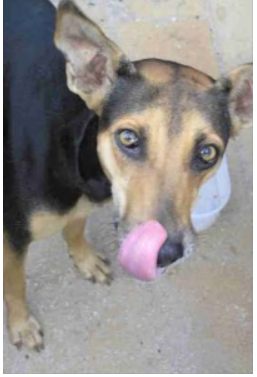

## Summary of the three Convolutional neural network model implemented on Dogs vs Cats dataset.

***

| Model No. 	| Architecture (Number and Size of Filters) 	| Epochs 	| Acc 	| Loss 	| Val_Acc 	| Val_Loss 	| image1 	| image2 	| image3 	|
|-	|-	|-	|-	|-	|-	|-	|-	|-	|-	|
| 1  	| 8,3 32,3 64,3 	| 10 	| 0.9376 	| 0.1603 	| 0.69 	| 1.1424 	|  	|  	|  	|
| 2 (best)	| 32,3 64,3 128,3 256,3 	| 20 	| 0.9787 	| 0.0694 	| 0.75 	| 1.1060 	| 0 	| 1 	| 1 	|
| 3 	| 8,2 32,2 64,2 128,2 	| 20 	| 0.9526 	| 0.1256 	| 0.71 	| 1.5257 	|  	|  	|  	|

* image1 :

* image2 : 

* image3 :

